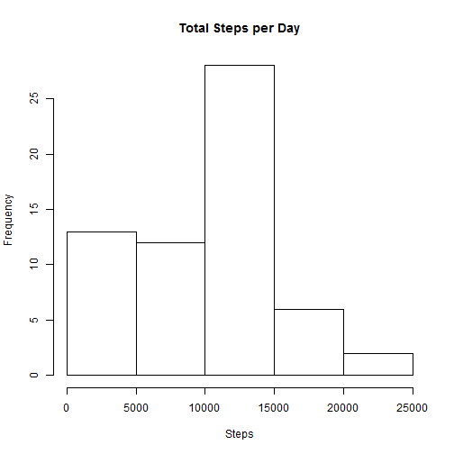
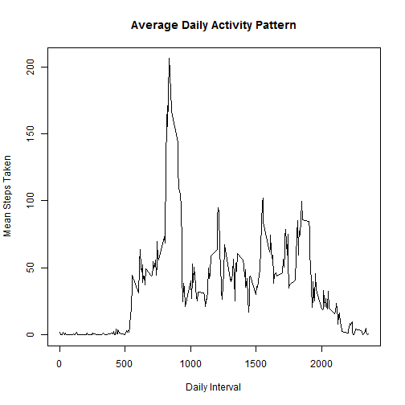
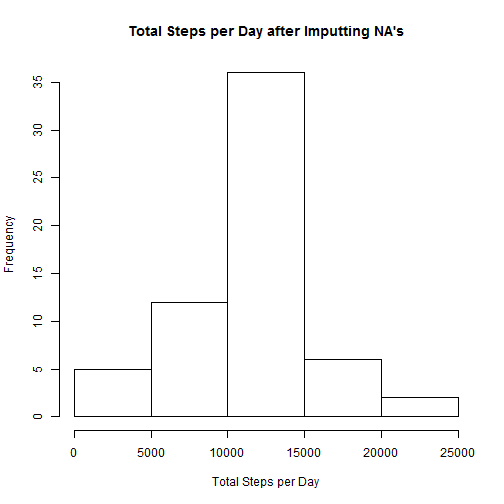
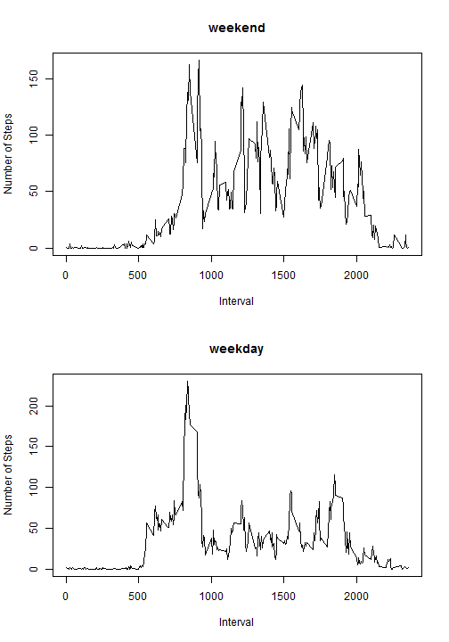

## Loading and preprocessing the data


```r
setwd("C:/Users/troyr_000/Documents/GitHub/RepData_PeerAssessment1")
if (!file.exists("activity.zip")){
  download.file("https://d396qusza40orc.cloudfront.net/repdata%2Fdata%2Factivity.zip", "activity.zip")
  unzip("activity.zip")
}
fitbit <- read.csv("activity.csv")
```

## What is mean total number of steps taken per day?


```r
hist(by(fitbit$steps, fitbit$date, sum, na.rm = TRUE), xlab = "Steps", main = "Total Steps per Day")
```

 


```r
mean(by(fitbit$steps, fitbit$date, sum, na.rm = TRUE))
```

```
## [1] 9354.23
```

```r
median(by(fitbit$steps, fitbit$date, sum, na.rm = TRUE))
```

```
## 2012-10-20 
##      10395
```

## What is the average daily activity pattern?


```r
plot(levels(as.factor(fitbit$interval)), by(fitbit$steps, as.factor(fitbit$interval), mean, na.rm = TRUE), type = "l", xlab = "Daily Interval", ylab = "Mean Steps Taken", main = "Average Daily Activity Pattern")
```

 

```r
meanList <- data.frame(steps = integer(), interval = integer())
for (dayInterval in as.integer(levels(as.factor(fitbit$interval)))){
  meanList <- rbind(meanList, c(mean(fitbit$steps[fitbit$interval == dayInterval], na.rm = TRUE), dayInterval))
}
names(meanList) <- c("steps", "interval")
meanList$steps <- as.integer(meanList$steps)
meanList$interval <- as.integer(meanList$interval)
meanList$interval[meanList$steps == max(meanList$steps, na.rm = TRUE)]
```

```
## [1] 835
```

## Imputing missing values


```r
w <- is.na(fitbit$steps)
length(w[w == TRUE])
```

```
## [1] 2304
```

```r
fixedFitbit <- fitbit
for (count in 1:nrow(fixedFitbit)){
  if (is.na(fixedFitbit[count,]$steps)){
    fixedFitbit[count,]$steps <- meanList$steps[meanList$interval == fixedFitbit[count,]$interval]
  }  
}
hist(by(fixedFitbit$steps, fixedFitbit$date, sum), xlab = "Total Steps per Day", main = "Total Steps per Day after Imputting NA's")
```

 

```r
mean(by(fixedFitbit$steps, fixedFitbit$date, sum))
```

```
## [1] 10749.77
```

```r
median(by(fixedFitbit$steps, fixedFitbit$date, sum))
```

```
## 2012-11-09 
##      10641
```

## Are there differences in activity patterns between weekdays and weekends?


```r
fixedFitbit$date <- as.Date(fixedFitbit$date)
daysList <- weekdays(fixedFitbit$date)
daysList[daysList == "Sunday"] <- "weekend"
daysList[daysList == "Saturday"] <- "weekend"
daysList[daysList != "weekend"] <- "weekday"
fixedFitbit <- cbind(fixedFitbit, isWeekday = as.factor(daysList))
par(mfrow = c(2,1))
with(fixedFitbit, {
  plot(levels(as.factor(fixedFitbit$interval)), by(fixedFitbit$steps[fixedFitbit$isWeekday == "weekend"], as.factor(fixedFitbit$interval[fixedFitbit$isWeekday == "weekend"]), mean), type = "l", main = "weekend", xlab = "Interval", ylab = "Number of Steps")
  plot(levels(as.factor(fixedFitbit$interval)), by(fixedFitbit$steps[fixedFitbit$isWeekday == "weekday"], as.factor(fixedFitbit$interval[fixedFitbit$isWeekday == "weekday"]), mean), type = "l", main = "weekday", xlab = "Interval", ylab = "Number of Steps")
})
```

 
